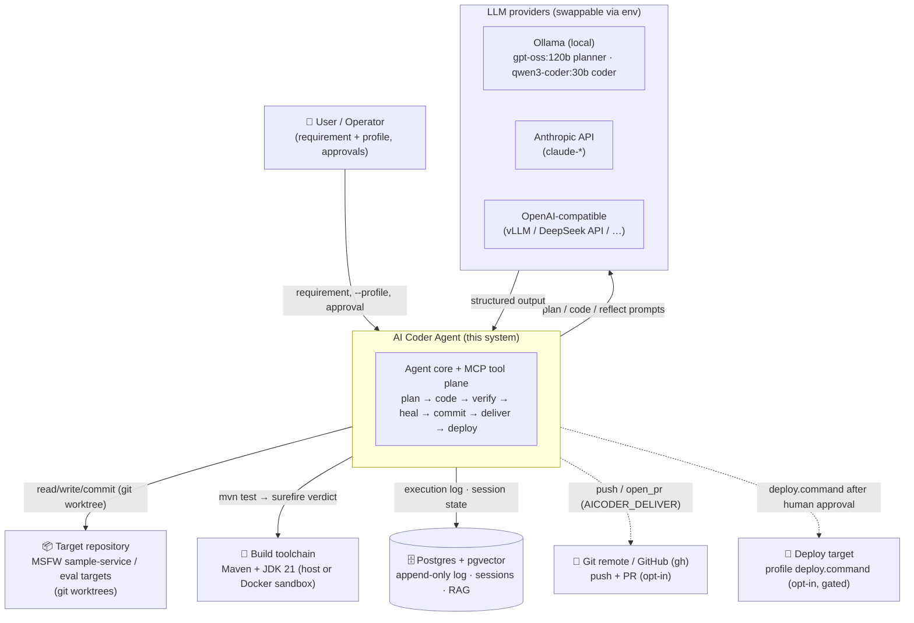

# 01 — Context View

**Viewpoint:** Context (system-in-its-environment). **Frames:** scope boundary,
external actors and dependencies, what is in/out of the system.

## Purpose & scope

The AI Coder Agent accepts a **requirement** (natural language) plus a **Project
Profile** (everything stack-specific, as data) and produces a **verified, committed
change** on a target code repository — optionally pushed, PR'd, and deployed behind
a human approval gate. The functional verdict comes from the **real build/tests**,
never from an LLM's opinion.

**In scope:** planning, whole-file code generation, deterministic verification,
reflection-driven self-healing, commit/PR/deploy orchestration, an objective
tests-as-oracle evaluation harness.

**Out of scope (today):** authoring requirements, running production clusters,
multi-repo program management, a web UI. Graph-DB code intelligence is deferred
(jdeps/LSP on demand).

## Context diagram

Solid arrows = default-path dependencies. Dashed = opt-in / gated (delivery to a
remote, deploy) — never exercised without explicit configuration/approval.

## External dependencies & boundaries

| External | Role | Boundary mechanism |
|---|---|---|
| LLM provider | Planning, coding, reflection | `LLMClient` abstraction; provider+model chosen by env, never code |
| Target repository | The code being changed | Isolated **git worktree** per session; whole-file writes; protected test globs |
| Build toolchain | The deterministic verdict | `BuildToolPort` → Maven MCP server; optional **Docker sandbox** isolates execution |
| Postgres + pgvector | Durable memory (audit log, sessions, RAG) | `MemoryPort`; least-privilege `agent_app` role enforces append-only |
| Git remote / GitHub | Delivery (push, PR) | git server `push` / `open_pr` via `gh`; opt-in; never auto-pushes to a real remote |
| Deploy target | Release | `DeployPort` runs `profile.deploy.command`; only after a human approves |

## Environment & key configuration (env-driven)

| Env var | Purpose |
|---|---|
| `AICODER_LLM_PROVIDER` / `AICODER_LLM_MODEL` | provider + model (anthropic\|ollama\|openai) |
| `AICODER_PLANNER_*` / `AICODER_CODER_*` | per-role model/provider split (fall back to `AICODER_LLM_*`) |
| `AICODER_REPO_PATH` | target repo (overrides the profile, for portability) |
| `AICODER_LLM_NUM_CTX` | Ollama context window (defaults too small otherwise) |
| `AICODER_MEMORY` | `inmemory` (default) \| `postgres` |
| `AICODER_SANDBOX` | unset (host build) \| `docker` (isolated build) |
| `AICODER_DELIVER` | `local` (default) \| `push` \| `pr` |
| `AICODER_APPROVAL` / `AICODER_DEPLOY_APPROVE` | deploy gate: interactive prompt / explicit go |
| `AICODER_EVAL_MSFW_TARGET` | sample-service source for the msfw eval suite |

See `05-decisions.md` for *why* configuration is env-driven and what stays in the
Project Profile.
