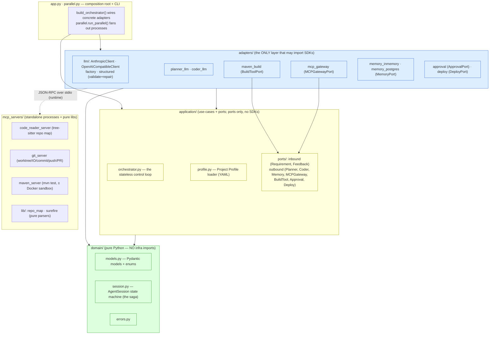

# 02 — Module View (Decomposition)

**Viewpoint:** Module / decomposition. **Frames:** code structure, layer
boundaries, allowed dependencies, testability, extension seams. **Model kind:**
layered module graph (Mermaid) + responsibility tables.

## The layers (hexagonal / ports & adapters)

Dependencies point **inward only**: `adapters → application → domain`. The domain
knows nothing of infrastructure; the application talks to the world **only through
ports** (Protocols). This is machine-enforced (see *Enforcement* below).

> The dotted `adapters ⇢ mcp_servers` edge is a **runtime** call (the gateway
> spawns/【talks to】 MCP server processes over JSON-RPC); it is **not** a Python
> import. `mcp_servers/` are standalone executables, not part of the layered core.

## Responsibilities by module

### domain/ — pure problem model (no infrastructure)
| Module | Responsibility |
|---|---|
| `models.py` | Pydantic value/entity models (`Plan`, `Task`, `CodeChange`, `FileEdit`, `ExecutionTrace`, `VerificationResult`, `ToolRequest/Response`) + `SessionState` enum |
| `session.py` | `AgentSession` — the **linear-saga state machine**; validates transitions, the circuit breaker + 3-strikes no-progress rule. Holds all session state |
| `errors.py` | Domain errors (`InvalidStateTransitionException`, `ToolInvocationError`) |

### application/ — use-cases & ports (talks to the world only via Protocols)
| Module | Responsibility |
|---|---|
| `orchestrator.py` | The **stateless control loop**: plan → code-all-tasks → verify-once → reflect-&-heal → commit → deliver → deploy. Holds no state (loads/saves the session via `MemoryPort`) |
| `profile.py` | Loads the **Project Profile** YAML (`build`, `architecture` + `test_pattern`, `healing`, `deploy`, `protected_globs`) — the stack-specific seam |
| `ports/inbound.py` | `RequirementPort`, `FeedbackPort` — how the world drives the loop |
| `ports/outbound.py` | `PlannerPort`, `CoderPort`, `MemoryPort`, `MCPGatewayPort`, `BuildToolPort`, `ApprovalPort`, `DeployPort` — what the loop calls out to |

### adapters/ — concrete realizations (the only SDK-importing layer)
| Module | Realizes | Responsibility |
|---|---|---|
| `llm/anthropic_client.py`, `llm/openai_client.py` | `LLMClient` | provider SDKs; `complete_json` (forced tool-use / json mode) + `complete_text` (with reasoning-channel fallback) |
| `llm/factory.py` | — | choose provider+model from env, **per role** |
| `llm/structured.py` | — | **validate-and-repair** loop: Pydantic-validate model output, feed errors back for a bounded retry (makes weak models usable) |
| `planner_llm.py` | `PlannerPort` | `generate_plan` + `reflect` (reasoning pass over failing code + history) |
| `coder_llm.py` | `CoderPort` | whole-file `apply_task` (+ error/strategy context on heal) |
| `maven_build.py` | `BuildToolPort` | parse surefire → **dual verdict** (functional vs architecture) |
| `mcp_gateway.py` | `MCPGatewayPort` | JSON-RPC client fanning out to MCP servers; surfaces `ok:false` as `ToolInvocationError` |
| `memory_inmemory.py`, `memory_postgres.py` | `MemoryPort` | session persist + append-only execution log (Postgres enforces append-only via RLS) |
| `approval.py` | `ApprovalPort` | `EnvApproval` / `InteractiveApproval` / `AutoDenyApproval` — deny-by-default deploy gate |
| `deploy.py` | `DeployPort` | `CommandDeploy` runs `profile.deploy.command` |

### mcp_servers/ — standalone tool processes (language-agnostic plane)
| Module | Responsibility |
|---|---|
| `code_reader_server.py` | tree-sitter **repo map** (skeleton-first) + symbol zoom-in |
| `git_server.py` | worktree create, read/write/list files, **reset_clean**, commit, **push**, **open_pr** |
| `maven_server.py` | `mvn test` (host) or inside a **Docker sandbox**; returns exit code + surefire summary |
| `lib/repo_map.py`, `lib/surefire.py` | pure parsing libs (tree-sitter, surefire XML) — unit-testable, no I/O policy |

### composition root
| Module | Responsibility |
|---|---|
| `app.py` | The one place allowed to know every concrete adapter; wires the object graph + CLI (`python -m aicoder "<req>" --profile …`) |
| `parallel.py` | `run_parallel()` — fan multiple requirements out as **isolated processes** (one worktree each) |

## Allowed-dependency rules (enforced, not just documented)

1. `domain` must not import `application`, `adapters`, or any infra SDK.
2. `application` must not import `adapters` or SDKs — only `domain` + its own ports.
3. The execution log is **append-only** (no update/delete path in any adapter).

**Enforcement:** `.importlinter` (3 contracts: *layered*, *domain-free-of-SDKs*,
*application-uses-ports*) + `tests/test_arch_fitness.py` (self-contained AST
backstop) + `tests/test_memory_append_only.py`. Run `uv run lint-imports`; CI runs
it on every push/PR. This is the agent applying its **own** TC-ARCH fitness rules
to itself (see the M4 dual-assessment idea in `04`/`05`).

## Extension seams

- **New LLM provider** → a new `LLMClient` in `adapters/llm/` + a factory branch. No core change.
- **New target stack** (e.g. Gradle/npm) → a new Project Profile + a `BuildToolPort` adapter (and maybe an MCP build server). The control loop is unchanged.
- **New tool** → a new MCP server (a new process), reached through the single `MCPGatewayPort`. No new port.
- **Durable vs ephemeral memory** → swap `MemoryPort` impl by env.
