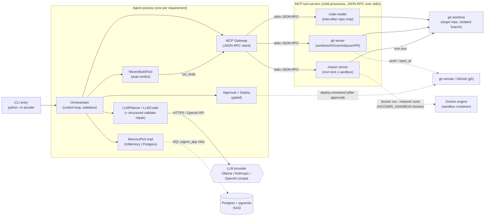
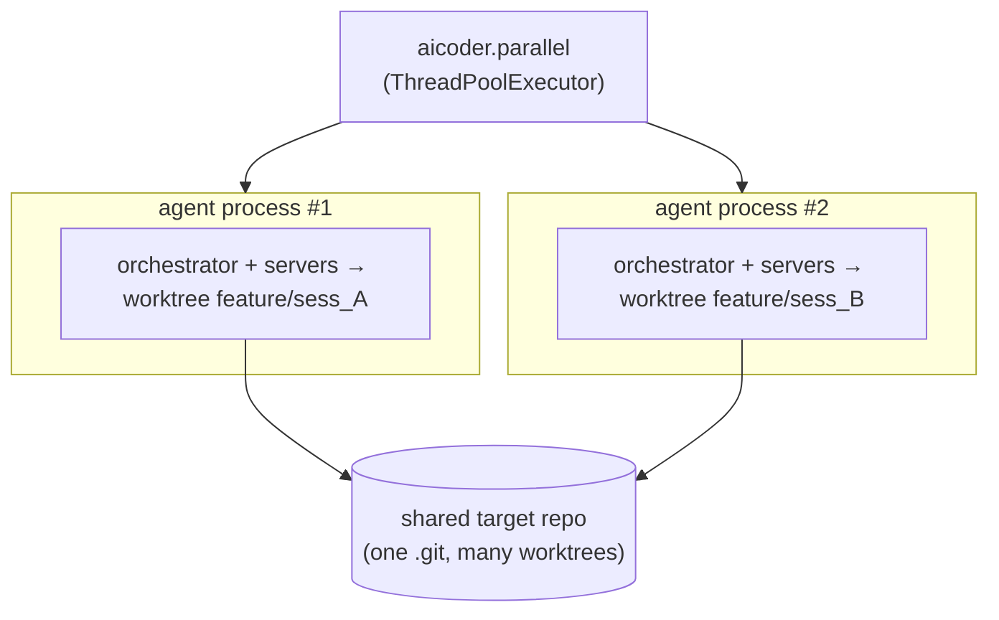

# 03 — Component-and-Connector (C&C) View

**Viewpoint:** C&C / runtime. **Frames:** what runs as a process at runtime, the
connectors between them, external systems, deployment & configuration. **Model
kind:** runtime component graph (Mermaid) + connector/responsibility tables.

## Runtime structure (one requirement)

Dotted connectors are opt-in/gated (sandbox, Postgres, push/PR, deploy);
solid connectors are the always-present default path.

## Components & responsibilities

| Component | Process | Responsibility |
|---|---|---|
| **Orchestrator** | agent | Drives the saga; holds no state (round-trips it through `MemoryPort`); enforces verify-once, heal budget, gates |
| **LLMPlanner / LLMCoder** | agent | Turn requirement+context into a `Plan` / `CodeChange`; `reflect()` diagnoses failures. Strong reasoner can plan while a fast model codes (per-role split) |
| **structured (validate-repair)** | agent | Pydantic-validates model output, re-prompts on mismatch — the robustness primitive for weak local models |
| **MavenBuildTool (Verifier)** | agent | Deterministic verdict from parsed surefire; splits **functional vs architecture** failures (M4) |
| **MCP Gateway** | agent | Single tool port; JSON-RPC to servers; raises on `ok:false`; graceful `-32601` |
| **MemoryPort impl** | agent | Session persistence + append-only execution log (`InMemory` default, `Postgres` durable) |
| **Approval + Deploy** | agent | Human gate (deny-by-default) then run the deploy command |
| **code-reader server** | child | Repo map (skeleton) + symbol zoom-in (tree-sitter) |
| **git server** | child | Worktree lifecycle, file IO, `reset_clean`, commit, push, open_pr |
| **maven server** | child | `mvn test` on the host, or inside a throwaway Docker container; returns exit code + surefire counts |

## Connectors

| Connector | Between | Protocol / mechanism | Notes |
|---|---|---|---|
| MCP JSON-RPC | gateway ↔ servers | newline-delimited JSON-RPC over **stdio** | one connection per server; **not** concurrency-safe → parallelism is process-level |
| LLM call | planner/coder ↔ provider | HTTPS (Anthropic) / OpenAI-compatible `/v1` (Ollama, vLLM) | provider+model from env |
| SQL | memory ↔ Postgres | psycopg, role `agent_app` | RLS denies UPDATE/DELETE on the log → append-only at runtime |
| Bind mount + `--network none` | maven server ↔ Docker | `docker run -v worktree -v ~/.m2 maven:… mvn -o test` | model code/plugins get no host FS / no network |
| git worktree | servers ↔ target repo | linked worktree per `feature/<session_id>` | isolation that makes parallel runs safe |

## Deployment & configuration

- **Single requirement:** one agent process + 3 short-lived MCP server children;
  external Ollama/Anthropic, optional Postgres (`docker compose up -d`, host :5433),
  optional Docker sandbox.
- **Parallel:** `python -m aicoder.parallel` launches **N independent agent
  processes**, each with its own server children and its own
  `feature/<session_id>` worktree — isolation is by OS process + worktree, so the
  per-server single stdio connection is never shared.

- **CI:** `.github/workflows/ci.yml` runs the agent's own gates (`lint-imports`,
  `pytest`) on every push/PR — the same dual-assessment philosophy applied to the
  agent itself.

See `04-behavioral-views.md` for how these components interact over time.
