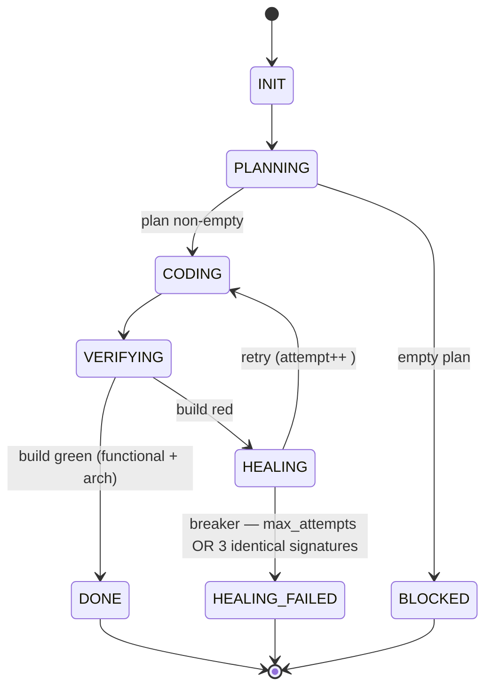
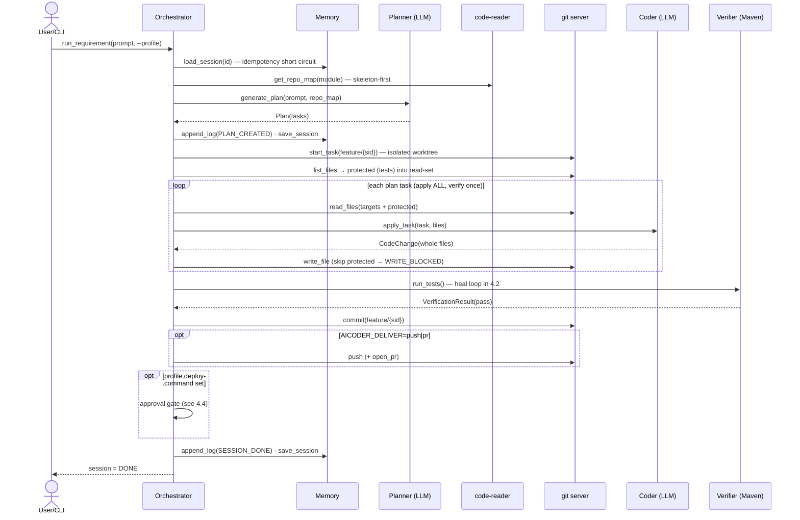
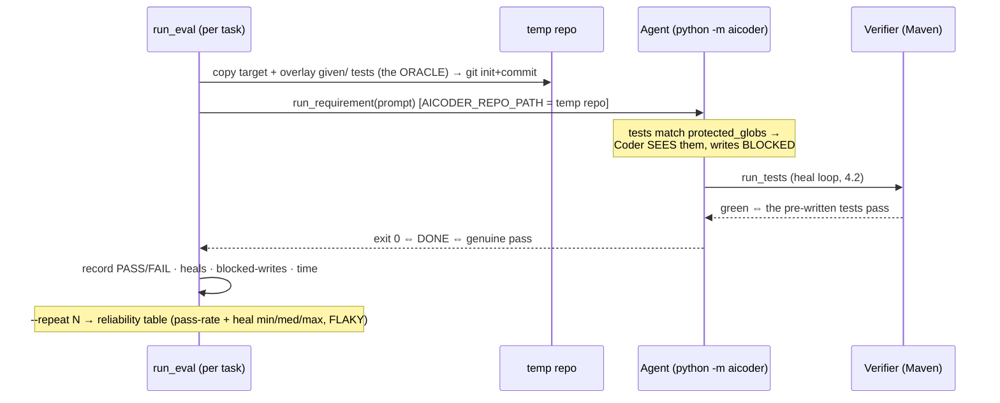
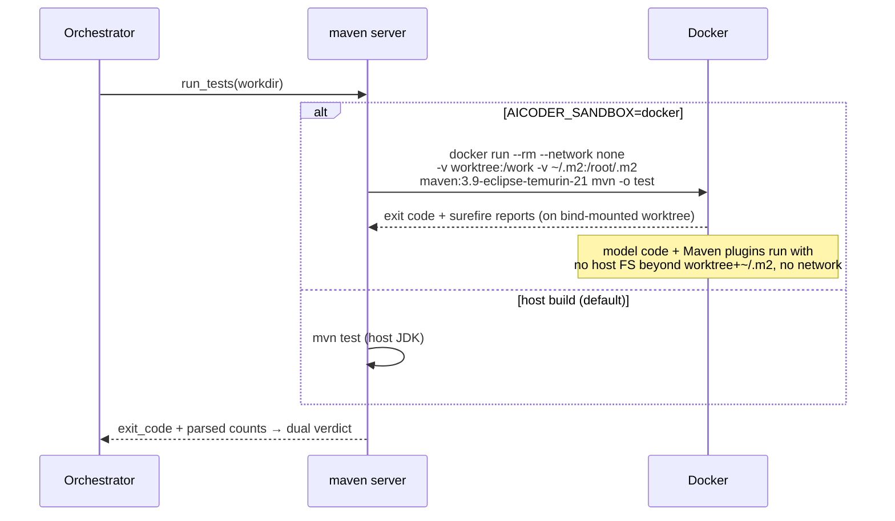

# 04 — Behavioral Views (Sequences & State)

**Viewpoint:** Behavioral. **Frames:** control flow over time for the important
flows. **Model kinds:** Mermaid `stateDiagram` (the saga) + `sequenceDiagram`
(end-to-end, heal loop, eval, sandbox, deploy gate).

## 4.0 Session state machine (the linear saga)

`AgentSession` (in `domain/session.py`) is the single source of saga state; the
Orchestrator is stateless and round-trips it through `MemoryPort`.



Breaker (`should_trip_breaker`): trips at `max_attempts`, or early on **3
consecutive identical** failure signatures (M3 gives reflection 2 chances to
change course; profile-gated via `no_progress_breaker`).

## 4.1 End-to-end: `run_requirement`



Key invariants: **plan all → apply all → verify once** (a weak model
over-decomposes; per-task verification fails on unavoidable non-compiling
intermediates). The Coder emits **whole files** (no fragile diff-apply). Tests are
read-only context, never written.

## 4.2 Reflection-driven self-heal (M3) — the core robustness loop

```mermaid
sequenceDiagram
    participant O as Orchestrator
    participant V as Verifier (Maven)
    participant G as git server
    participant P as Planner.reflect (reasoner)
    participant C as Coder (fast code model)

    O->>V: run_tests()
    V-->>O: FAIL (failed_tests, evidence, signature,<br/>functional_passed / arch_passed)
    O->>O: record_failure(signature); breaker? → HEALING_FAILED if tripped
    O->>O: widen context — add every .java the compiler blamed
    O->>G: read failing files (current, broken state)
    alt reset_to_clean (profile)
        O->>G: reset_clean → restore cumulative `applied`<br/>(never drop earlier correct edits)
    end
    O->>P: reflect(requirement, distilled error, FAILING FILES, history)
    P-->>O: concrete fix strategy (differs each attempt → escapes temp-0 fixpoint)
    O->>C: apply_task(heal, files, "strategy + exact build output")
    C-->>O: CodeChange
    O->>G: write_file
    O->>V: run_tests() — loop until green or breaker
```

Why each piece exists (empirically learned): reflection must **see the failing
code** (else the reasoner hallucinates the code shape); the reasoner needs a big
token budget + a reasoning-channel fallback (thinking models return empty
`content` otherwise); reset-to-clean must **restore** the cumulative change (a bare
`git reset` silently drops a correct earlier test edit while `mvn` stays green).

## 4.3 Eval harness — tests-as-oracle (objective scoring)



A green run is a **genuine** pass because the agent cannot edit the tests — closing
the "agent dropped the test, mvn still green" false positive. `leaderboard.py`
sweeps several (planner, coder) configs through this and tabulates.

## 4.4 Deploy approval gate (M6) — safe by default

```mermaid
sequenceDiagram
    participant O as Orchestrator
    participant H as ApprovalPort (human)
    participant D as DeployPort (CommandDeploy)

    note over O: only reached for a GREEN, committed change<br/>AND only if profile.deploy.command is set
    O->>O: append_log(APPROVAL_REQUESTED)
    O->>H: request_approval(summary)
    alt approved (AICODER_DEPLOY_APPROVE=1 / interactive y)
        H-->>O: true
        O->>D: deploy(workdir, command)
        D-->>O: ok / error
        O->>O: log DEPLOYED | DEPLOY_FAILED
    else denied (default)
        H-->>O: false
        O->>O: log DEPLOY_DENIED — nothing deployed; DONE still stands
    end
```

## 4.5 Sandboxed verification (M5) — isolated build


