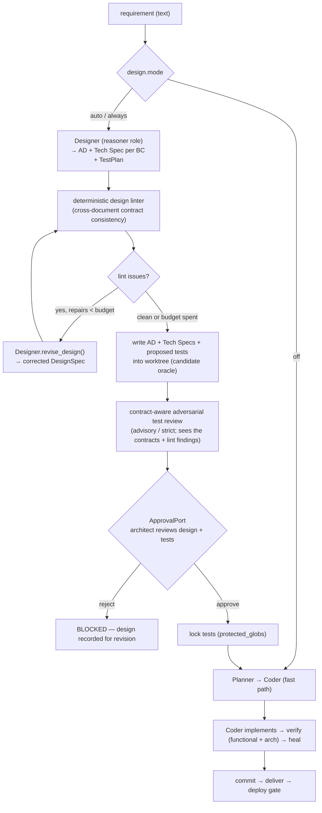
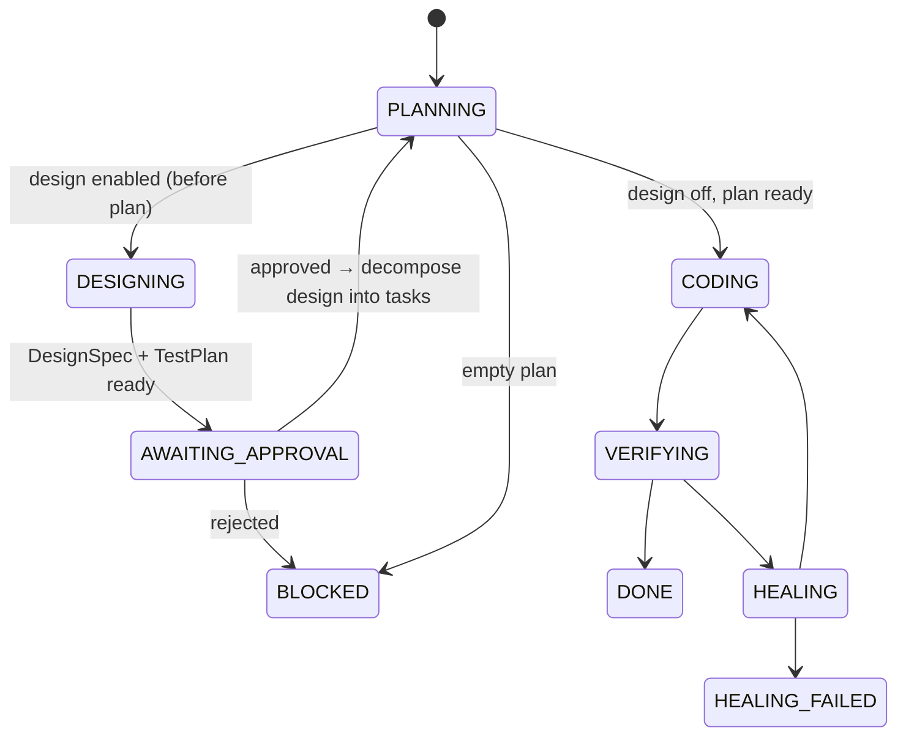

# 07 — Proposal / ADR: Explicit Design-First Phase

**Status:** **IMPLEMENTED — all 5 slices done** (Designer role + DesignSpec/TestPlan;
human gate + approved tests locked as the oracle; adversarial test review; **deterministic
cross-document consistency linter + bounded design-heal**).
**Pipeline reordered: Design runs BEFORE Planning** — a plan is the implementer's
decomposition, not a gate before design, so a flaky/empty plan can no longer block
the design. Plan-keyed complexity tiering was **removed** (it needed a plan in hand)
and **replaced** by a plan-free, text-based heuristic now shared with the Analysis
phase (ADR-08 Slice 4, `application/tiering.py`): `auto` designs only non-trivial
requirements, `always` designs every one. Promote to an accepted AD. **Viewpoint:**
Decision. **Supersedes nothing; extends** AD-8/AD-9/AD-11/AD-15 (`05-decisions.md`).

> This document is itself the "design output before code" that the proposal
> advocates — written and reviewable *before* any implementation.

## Context — the implicit shortcut

Today the pipeline is `requirement (text) → Planner → Coder → verify`. The Planner
emits a thin `Plan` (tasks + target files + constraints) but the agent **does not
produce a reviewable design** (architecture/interface decisions) nor **design the
tests** — in eval the tests are pre-written by humans (the oracle); in normal runs
the target's existing tests verify. So "design + test cases as first-class outputs"
is skipped / implicit.

**Principle to preserve:** this system's strength is that *spec is checkable by
machine*. The two highest-value "design" artifacts here are already **executable** —
**test cases** (behavioral oracle) and **ArchUnit rules** (M4, architecture-as-test).
Prose design that isn't tied to a check is decoration ("design theater").

## Decision

Add an **explicit Design phase** (a new *role/phase* in the existing orchestrator —
**not a separate agent**) that, for non-trivial requirements, produces:
1. a **DesignSpec** — a *delta* design: affected components/interfaces, contract
   changes, short ADR notes (prose, kept lightweight); and
2. a **TestPlan** — **executable proposed test cases** (test files) that encode the
   acceptance criteria.

A **human approval gate** sits on the DesignSpec+TestPlan. On approval, the proposed
tests are written into the worktree and **locked as the oracle** (`protected_globs`);
the Coder then implements to make them pass — reusing the exact tests-as-oracle
mechanism, but with **agent-proposed + human-approved** tests instead of pre-written
ones. **Tiered:** trivial changes skip design (fast path); complex/novel ones take
the design-first path.

### Why a phase, not a new agent
The hexagonal core + per-role LLM split already support this with minimal addition;
a separate deployable agent only pays off if the design process must be
independently owned/scaled (a later option, not now). See `05-decisions.md` AD-13's
reasoning style.

## Proposed flow

Design precedes the plan: the **approved** design is what the Planner decomposes into
implementation tasks, so planning can never gate (or be skipped by) the design step.

## Extended session state machine

The saga briefly re-enters `PLANNING`: `INIT → PLANNING → DESIGNING → AWAITING_APPROVAL
→ PLANNING (resume_planning, decompose the approved design) → CODING`. When design is
`off`, it stays in the original `PLANNING → CODING` path.

## What it reuses (low marginal cost)

| New need | Reuses |
|---|---|
| Designer runs on a strong reasoner | **per-role LLM split** (`AICODER_DESIGNER_*`, falls back like planner/coder) |
| Validated DesignSpec/TestPlan output | **`structured.generate_structured()`** (Pydantic + repair) |
| Human review of design + tests | **`ApprovalPort` (M6)** — generalize from "deploy gate" to a typed gate (`design` / `deploy`) |
| Agent-proposed tests become the oracle | **`protected_globs` + tests-as-oracle** (AD-11) — write proposed tests, then protect them |
| Architecture intent enforced | **M4 ArchUnit dual gate** — the design's arch constraints can be emitted as rules |
| Auditable artifacts | **append-only execution log** — `DESIGN_PROPOSED`, `DESIGN_LINT`, `DESIGN_REVISED`, `DESIGN_APPROVED/REJECTED`, `TESTS_LOCKED` events |
| Design self-consistency without a model call | **deterministic linter** (`application/design_lint.py`, pure function over `DesignSpec`) — mirrors the "verifier deterministic-first" principle (`05-decisions.md`) |
| Auto-revise an inconsistent design | **bounded design-heal** — same `generate_structured` + feedback loop the Coder's heal uses, keyed on the linter instead of a compiler error |

## New elements to add (when implemented)

- **Port** `DesignPort` (outbound): `propose_design(requirement, repo_map) -> DesignSpec`
  and `revise_design(requirement, repo_map, previous, issues, analysis) -> DesignSpec`
  (design-heal).
- **Adapter** `adapters/designer_llm.py` (`LLMDesigner`, reasoner role).
- **Domain models**: `DesignSpec { summary, affected, interface_changes[], adr_notes, test_plan: ProposedTest[] }`, `ProposedTest { path, content, rationale }`.
- **Consistency linter**: `application/design_lint.py` — `lint_design(spec) -> list[str]`
  (pure, deterministic) + `render_contracts(spec)` (the per-context contracts digest fed
  to the Reviewer and to `revise_design`).
- **Session states**: `DESIGNING`, `AWAITING_APPROVAL` (+ transitions); `ApprovalPort.request_approval(kind, summary)` gains a `kind`.
- **Config**: `design.mode = off | auto | always` in the Project Profile; `AICODER_DESIGN` env override; complexity heuristic (or Designer self-classifies) for `auto`; `design.review_strict`; `design.max_design_repairs` (design-heal budget, default 1, 0 = off).
- **Orchestrator**: a `DESIGNING → lint → (bounded heal) → review → approval → lock-tests → CODING` segment before the coding phase (`_repair_design`).

## Risks & mitigations

| Risk | Mitigation |
|---|---|
| **Weak/wrong oracle** (agent writes easy tests, then passes them) | Human approves the **TEST CASES** specifically (the load-bearing gate). Optional **adversarial review** pass (second model / different role): "does this test actually constrain the requirement? edge cases? trivially-satisfiable?" before locking. |
| **Design theater** (pretty prose, no constraint) | Keep prose minimal; the binding artifacts are the **executable tests + arch rules**, which the deterministic Verifier enforces. |
| **Self-inconsistent multi-BC design** (a flow calls an undeclared method; a type has two owners; naming drift — the build can't compile no matter how good the Coder is) | **Deterministic design linter** (no LLM) cross-checks the contracts before the gate (undeclared-method-in-flow, conflicting arity across interfaces, type owned by ≥2 contexts / referenced with no shared-kernel decision, status-enum suffix drift); findings drive a **bounded design-heal** (Designer auto-revises) and, under `review_strict`, block. The **Reviewer now also sees the contracts**, not just the tests. Found on the Digital Library e2e run (3 BCs → `HEALING_FAILED` from duplicated `Copy`/`CopyStatus`). |
| **Over-process** on small changes | **Tiering** — trivial tier skips design entirely (current path). |
| **Bootstrapping** (who guards the guard?) | Human gate + the existing immutable audit log; tests, once locked, are uneditable by the Coder. |
| **Latency/cost** | Extra reasoner passes only on the complex tier; reuse cached repo map. |

## Phased implementation plan

1. **Slice 1 — Designer role + DesignSpec (no gate yet) — ✅ DONE.** `DesignPort` +
   `LLMDesigner` (reasoner role, `AICODER_DESIGNER_*`); emit a schema-validated
   `DesignSpec` + `TestPlan` and log `DESIGN_PROPOSED`. Opt-in via `design.mode` /
   `AICODER_DESIGN` (default `off` → current fast path, unchanged). No gate / no
   test-locking yet. Unit-tested (`tests/test_designer.py`) + proven e2e: with a
   real reasoner (gpt-oss:120b) the agent produced a valid DesignSpec
   (summary, affected file, a proposed `AccountWithdrawTest`) before coding, then
   reached DONE without disruption.
2. **Slice 2 — Approval gate + lock-as-oracle — ✅ DONE.** `ApprovalPort` generalized
   with `kind` (`design`/`deploy`, kind-specific `AICODER_{KIND}_APPROVE`). New
   session states `DESIGNING` / `AWAITING_APPROVAL` (+ transitions). The Designer
   writes its proposed tests into the worktree; a human gates them; **on approve they
   are LOCKED** (added to the protected set → the Coder reads them as the oracle but
   cannot overwrite them) and the run proceeds to CODING; **on reject → BLOCKED**
   before any coding. Unit-tested (gate approve→`WRITE_BLOCKED` on tamper, reject→
   BLOCKED, kind-specific approval). Proven e2e: gpt-oss proposed an
   `AccountWithdrawTest`, it was approved + locked, and the Coder implemented
   `withdraw` to pass its own approved test → green at 0 heals.
   **Materialized artifacts:** the design is written as explicit, reviewable files in
   the target worktree — one umbrella **Architecture Description** (`docs/design/AD.md`)
   plus **one Tech Spec per bounded context** (`docs/design/techspec-<bc>.md`; **1 BC
   = 1 Tech Spec**) — committed with the change; the architect reviews these at the
   gate. Docs + locked tests are recorded in the cumulative `applied` set so a
   reset-to-clean heal cannot wipe them. (`profile.design.docs_dir`, default `docs/design`.)
3. **Slice 3 — Config + tiering — ✅ DONE, reworked by the reorder.** `design.mode
   = off | auto | always`. `off` is the fast path (no design). Originally `auto` designed
   only **complex** changes via a deterministic `_is_complex` heuristic (more than one
   task OR touched file) — but that read the plan, and the **pipeline reorder moved design
   ahead of the plan**, so there was no plan to tier on. The plan-keyed `_is_complex`
   was **removed and replaced** by a plan-free, text-based heuristic shared with the
   Analysis phase (`application/tiering.py`, ADR-08 Slice 4): `auto` now tiers on the
   requirement's SCOPE + VAGUENESS (not file count), logs `DESIGN_SKIPPED` on trivial
   changes; `always` ignores it; `off` skips. Unit-tested (`tests/test_designer.py`
   auto-skips-trivial / auto-designs-complex / always-designs; `tests/test_tiering.py`).
4. **Slice 4 — Adversarial test review — ✅ DONE.** A `ReviewPort` + `LLMReviewer`
   (the `reviewer` role, ideally a DIFFERENT model from the Designer) critiques the
   proposed TestPlan before locking: trivially-satisfiable? missing edge cases?
   asserting implementation details? actually tied to the requirement? `TEST_REVIEW`
   is logged and the concerns are surfaced into the approval request. Default
   **advisory** (the human decides with concerns in hand); `design.review_strict`
   makes a failed review **auto-block** (BLOCKED) before the gate. Unit-tested
   (ok→gate, strict+weak→auto-block, advisory+weak→surface→approve). Proven e2e:
   with the Designer on gpt-oss and the reviewer on qwen3-coder, the reviewer found
   genuine weaknesses in a proposed AccountWithdrawTest (no balance-unchanged-after-
   exception check, missing zero/negative-amount cases, brittle message assertion)
   and surfaced them to the gate.

5. **Slice 5 — Deterministic consistency linter + bounded design-heal — ✅ DONE.**
   Motivated by the **Digital Library e2e run** (`examples/e2e-library-lending/`): the
   design half scaled cleanly to **3 bounded contexts**, but the code half hit
   `HEALING_FAILED` because the design was **internally self-contradictory** in ways no
   Coder could fix — a key-flow called `CatalogService.setCopyStatus(...)` that no
   interface declared, `Copy`/`CopyStatus` had no single owner (so the Coder re-created
   them per package → `incomparable types`), and a status-enum suffix drifted
   (`CopyStatus` vs `LoanState`). The adversarial Reviewer (Slice 4) could not catch any
   of it — **it only saw the tests, never the contracts**. Three additions close the gap:
   - **(linter)** `application/design_lint.py` — a **pure, deterministic** `lint_design`
     cross-checks the `DesignSpec` for: L1 a method invoked in a key-flow that no
     interface/aggregate declares; L2 the same method declared with conflicting arity
     across two interface contracts; L3 a type owned by ≥2 contexts (L3a) or referenced
     across a boundary with no shared-kernel / published-language decision (L3b); L4
     status-enum suffix drift. No model call — consistent with the "verifier
     deterministic-first" principle. Logs `DESIGN_LINT {ok, issues, repairs}`.
   - **(design-heal)** the orchestrator's `_repair_design` hands any lint findings back to
     the Designer's new `revise_design(...)` and re-lints, bounded by
     `design.max_design_repairs` (default 1, 0 = off). Keyed on the **linter** (objective,
     machine-checkable), not the advisory LLM review. Logs `DESIGN_REVISED` per attempt;
     the architect then gates a design that is already consistent (or, if heal can't
     converge, sees the residual issues). Under `review_strict`, a failed review **or** an
     unresolved lint finding auto-blocks.
   - **(contract-aware review)** `ReviewPort.review_tests(..., contracts="")` now receives
     a per-context digest of the interfaces, invariants, domain model and key flows
     (`render_contracts`), and the Reviewer prompt cross-checks the tests **against** the
     contracts — undeclared calls, two-signature methods, types with no single owner —
     instead of judging the tests in a vacuum. The Designer prompt also gained an explicit
     **shared-kernel / one-signature / consistent-naming** section so the model avoids the
     class up front. Unit-tested: `tests/test_design_lint.py` (each L-class + a clean
     design + the service-vs-aggregate false-positive guard) and `tests/test_designer.py`
     (lint logged + surfaced to the gate; strict block on lint; heal converges before the
     gate; heal bounded then blocks; repairs disabled; Reviewer receives contracts).

**Acceptance (e2e on the eval target):** given a non-trivial requirement, the agent
produces a DesignSpec + proposed tests → a human approves → the tests are locked →
the Coder implements until they pass → `mvn test` green (functional + arch). The
agent **authored** the oracle, a human **approved** it, and the Coder could **not**
edit it afterward.

## Correspondence (to update when built)

Implementing this updates: `02` (new `DesignPort` + adapter), `03` (a Designer
component in the agent process), `04` (a new design sequence + the extended state
machine here), `05` (promote this to an accepted AD), `06` (move from "weak/unbuilt"
to capability).
