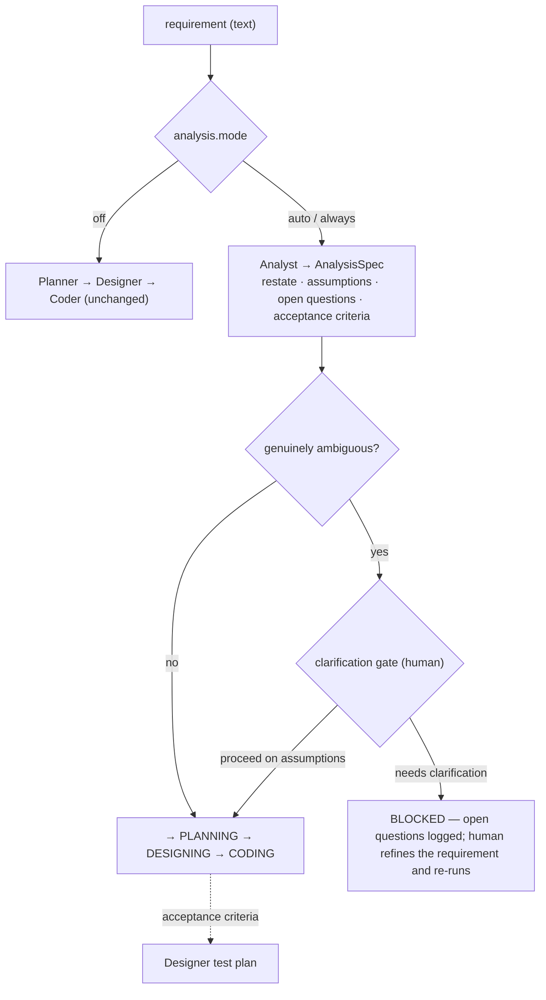
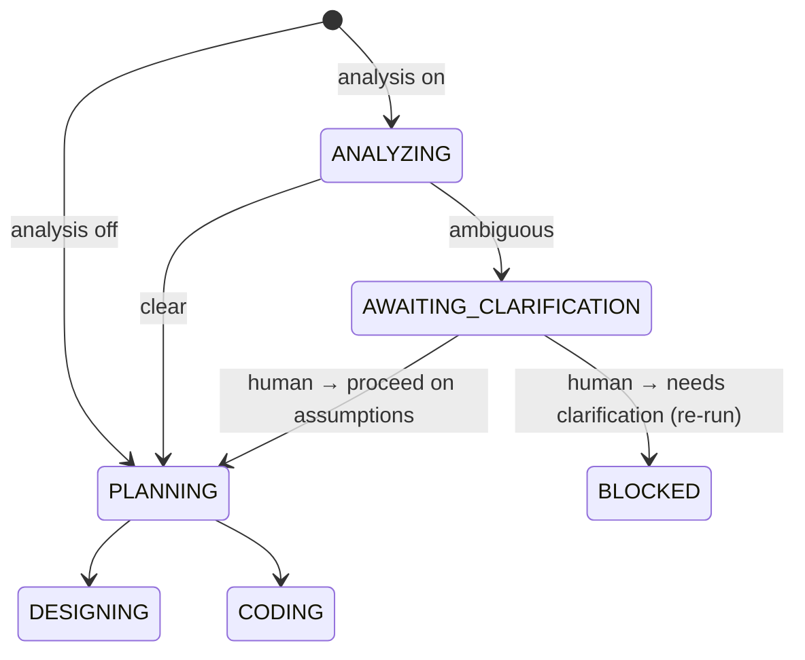

# 08 — Proposal / ADR: Explicit Analysis (Requirement-Clarification) Phase

**Status:** Proposed (not yet implemented). **Viewpoint:** Decision.
**Complements** ADR-07 (`07-design-first-proposal.md`): ADR-07 made *design* (HOW)
explicit; this makes *analysis* (WHAT) explicit, one phase earlier.

> Like ADR-07, this document is itself the design-before-code artifact it advocates.

## Context — analysis is still implicit

After ADR-07 the pipeline is `requirement → Planner → Designer → Coder → verify`.
But there is no explicit **analysis** step in the classic sense — *understand and
pin down WHAT before deciding HOW*: restate the requirement, surface assumptions,
flag ambiguities / open questions, and derive acceptance criteria. Today the raw
requirement text flows straight into planning/design; "analysis" is folded
implicitly into the Planner (decompose) and Designer (summary + test plan). A
genuinely under-specified requirement is therefore only discovered *after* design
or coding effort is spent — or silently resolved by the model's unstated guesses.

Mapping to a classic SDLC (see `06`):

| Phase | In the agent | Explicit? |
|---|---|---|
| Requirements | input text + Project Profile | input |
| **Analysis** (restate · assumptions · open questions · acceptance) | implicit in Planner/Designer | ❌ |
| Design | Designer → DesignSpec + TestPlan (ADR-07) | ✅ |
| Implementation / Test / Deploy | Coder / Verifier / gated deploy | ✅ |

## Decision

Add an explicit **Analysis phase** (a new *role/phase*, not a separate agent) that
runs **before planning** and produces an **AnalysisSpec**: a restatement,
assumptions, open questions, and **acceptance criteria** (which then feed the
Designer's test plan). When the requirement is genuinely ambiguous, the agent
**asks the human** at a *clarification gate* rather than guessing — deny-by-default
(block for clarification), with an explicit "proceed on the stated assumptions"
override for autonomy. **Tiered & opt-in** (`analysis.mode`), exactly like design.

### Why a phase, not a new agent
Same reasoning as ADR-07: the hexagonal core + per-role LLM split + `ApprovalPort`
already make this cheap. A separate agent only pays off if analysis must be
independently owned/scaled.

## Proposed flow

## Extended session state machine (prefix to ADR-07's machine)

## What it reuses

| New need | Reuses |
|---|---|
| Analyst on a reasoner | **per-role LLM split** (`AICODER_ANALYST_*`) |
| Validated AnalysisSpec | **`structured.generate_structured()`** |
| Clarification gate | **`ApprovalPort`** with `kind="clarification"` (deny → block; `AICODER_CLARIFICATION_APPROVE=1` → proceed on assumptions) |
| Acceptance criteria → tests | hand `AnalysisSpec.acceptance_criteria` to the **Designer** (ADR-07) so the proposed tests trace to explicit criteria |
| Audit | execution log events `ANALYSIS_DONE`, `NEEDS_CLARIFICATION`, `CLARIFICATION_*` |

## New elements (when implemented)

- **Domain** `AnalysisSpec { restatement, assumptions[], open_questions[], acceptance_criteria[], ambiguous: bool }`.
- **Port** `AnalysisPort` (outbound): `analyze(requirement, repo_map) -> AnalysisSpec`.
- **Adapter** `adapters/analyst_llm.py` (`LLMAnalyst`, analyst role).
- **Session states** `ANALYZING`, `AWAITING_CLARIFICATION` (+ transitions).
- **Config** `analysis.mode = off | auto | always` (auto tiers like design); `ApprovalPort.kind` gains `"clarification"`.
- **Orchestrator** `_run_analysis()` before planning; on ambiguous → clarification gate; pass acceptance criteria forward to `_run_design`.

## Risks & mitigations

| Risk | Mitigation |
|---|---|
| **Over-blocking** (analyst flags everything ambiguous) | Prompt it to flag `ambiguous` ONLY when it genuinely cannot proceed responsibly; default `mode=off`; the gate can always proceed-on-assumptions. Tier with `auto`. |
| **Analysis theater** (prose nobody uses) | The binding output is `acceptance_criteria`, which **feeds the executable test plan** (ADR-07) — analysis traces into tests, not just a doc. |
| **No answer-injection channel** | The clarification gate is proceed/block (not free-form Q&A): block → the human refines the *requirement text* and re-runs (clean, idempotent). A richer interactive Q&A loop is a later option. |
| **Latency/cost** | Opt-in + `auto` tiering; one reasoner pass; reuse the cached repo map. |

## Phased implementation plan

1. **Slice 1 — Analyst role + AnalysisSpec (no gate):** `AnalysisPort` + `LLMAnalyst`; run before planning when enabled; log `ANALYSIS_DONE`. Opt-in via `analysis.mode` (default off → unchanged). Unit-test with a fake analyst.
2. **Slice 2 — Clarification gate:** state `ANALYZING` + `AWAITING_CLARIFICATION`; on `ambiguous`, gate via `ApprovalPort("clarification")` → proceed-on-assumptions or `BLOCKED` (log `NEEDS_CLARIFICATION` with the open questions). State tests.
3. **Slice 3 — Analysis → Design hand-off:** pass `acceptance_criteria` into the Designer so proposed tests trace to explicit criteria; log the linkage.
4. **Slice 4 (optional) — tiering** consistent with design (`auto`), and/or fold analysis+design into one gate when both are on.

**Acceptance (e2e on the eval target):** an under-specified requirement produces an
AnalysisSpec with open questions → the agent blocks at the clarification gate (or
proceeds on logged assumptions when approved); a well-specified one yields
acceptance criteria that the Designer's tests demonstrably cover.

## Correspondence (to update when built)

Implementing this updates `02` (new `AnalysisPort` + adapter), `03` (an Analyst
component), `04` (an analysis sequence + the extended state machine here), `05`
(promote to an accepted AD), `06` (move Analysis from implicit to explicit in the
SDLC table).
